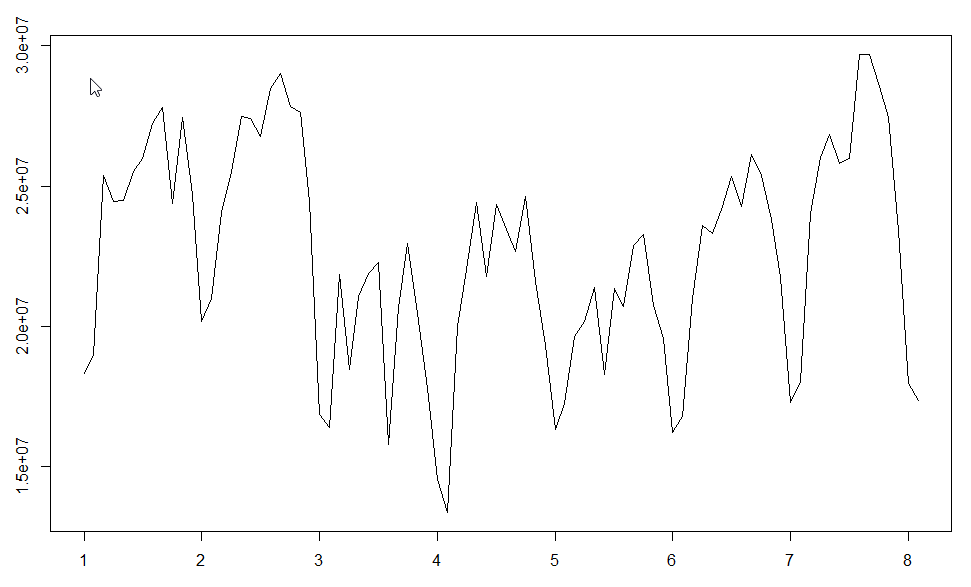
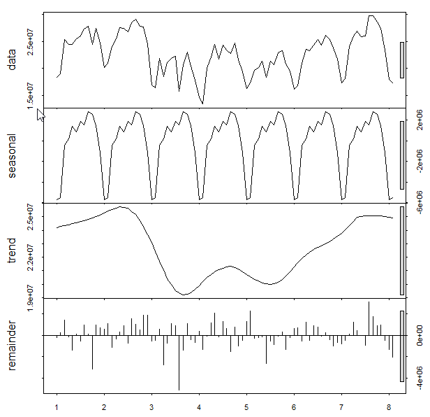
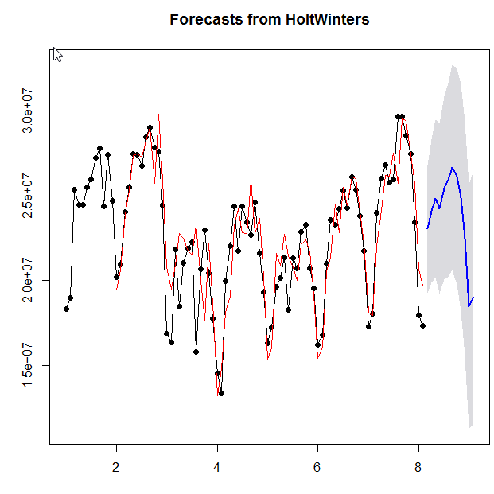
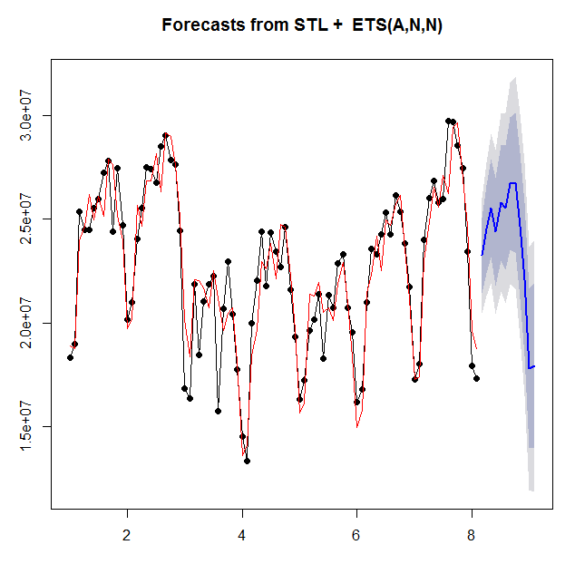
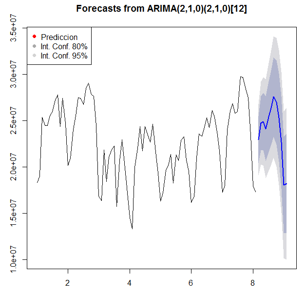

# Molinetes


### Analisis temporal de **Molinetes - Subte CABA** periodo **2015-2017**.

Analizar el comportamiento temporal de la cantidad de personas que utilizan el servicio de transporte Subterraneo en CABA.
Utilizamos modelos temporales analizando sus tres componentes
1) tendencia 
2) su ciclo estacional
3) su propia regularidad o irregularidad pura

```r

library(forecast)
library(zoo)
library(timeDate)
```
Los datos los obtuve a partir de la iniciativa del GCBA de "Apertura de Datos" https://data.buenosaires.gob.ar/datasets?categories.slug=movilidad-y-transporte.


```r
# Necesitamos convertir nuestro dataset en un objeto que R
# reconozca como Serie Temporal.  Cubriremos dos formatos de varios formatos,
fechas <- with(subte, ISOdate(año, mes, dia))
```

```r
subtes <- zoo(x = subte$u, order.by = fechas)

```
Ok Ya a simple vista podemos empezar a ver algo



Empezemos con los modelo!!
```r
# simple exponencial - modela nivel (remainder), sin tendencia ni componente estacional
modelo.simple <- HoltWinters(subtes, beta=FALSE, gamma=FALSE)

modelo.simple

# doble exponencial - modela nivel (remainder) y tendencia, sin componente estacional
modelo.doble <- HoltWinters(subtes, gamma=FALSE)
modelo.doble

# triple exponencial - modela datos, tendencia y componente estacional
modelo.completo <- HoltWinters(subtes)
summary(modelo.completo)
```
En esta imagen vemos la importancia de la tendencia y la estacionalidad
En el 2011 se observa máximo de pasajeros, luego decaimiento en años siguientes hasta el punto de quiebre al alza a partir de 2015, observando valores superiores a 300M en 2016. La reduccion posiblemente sea por la suba de precios del boleto durante el periodod 2012-2015. La estacionalidad se observa en su pico durante 3T.



Predicciones de los próximos 12 meses
```r
prediccion <- predict(modelo.completo, n.ahead=12)
prediccion2 <- forecast(modelo.completo, h=12, level = .95)
```


Y utilizando la función de predicción y gráficos del paquete forecast.
```r
plot.forecast(prediccion2)
plot.splineforecast(prediccion2)
```

Predicciones automáticas utilizando modelos exponenciales

```r
modelo.stlf <- stlf(subte.ts)

prediccion3 <- forecast(modelo.stlf, h = 12 )
summary(prediccion3)
```
Nos da intervalos de confianza. Si miramos el resumen del pronóstico3, podremosver a qué intervalos se refiere cada color y explicarlo al presentar el grafico.
```r
plot.forecast(prediccion3, ylim = c(10000000,40000000), fcol = "red", 
              shadecols = c("grey", "lightblue"))
legend("topleft", c("Prediccion", "Int. Conf. 80%", "Int. Conf. 95%"), pch = 19,
       col = c("red","lightblue", "grey"))
```



Predicción automática usando modelo ARIMA.
```r
modelo.arima <- auto.arima(subte.ts)
class(modelo.arima)
prediccion.arima <- forecast.Arima(modelo.arima, h=12)
plot.forecast(prediccion.arima)
legend("topleft", c("Prediccion", "Int. Conf. 80%", "Int. Conf. 95%"), pch = 19,
       col = c("red","darkgrey", "lightgrey"))
```




La Predicción STL se comporta de mejor forma para la predicción en pasajeros por molinetes.

Proximamente:
_ Apertura por linea de subte

Ideas que dejo:
_ Verificar motivo el componente estacional (temperatura, mm de lluvias)
_ Explicar la baja durante el periodo 2012-2014 (Aumento de Precio, uso ECOtranporte - Bicicletas)

Este estudio tiene infinitas aristas... Continuará
